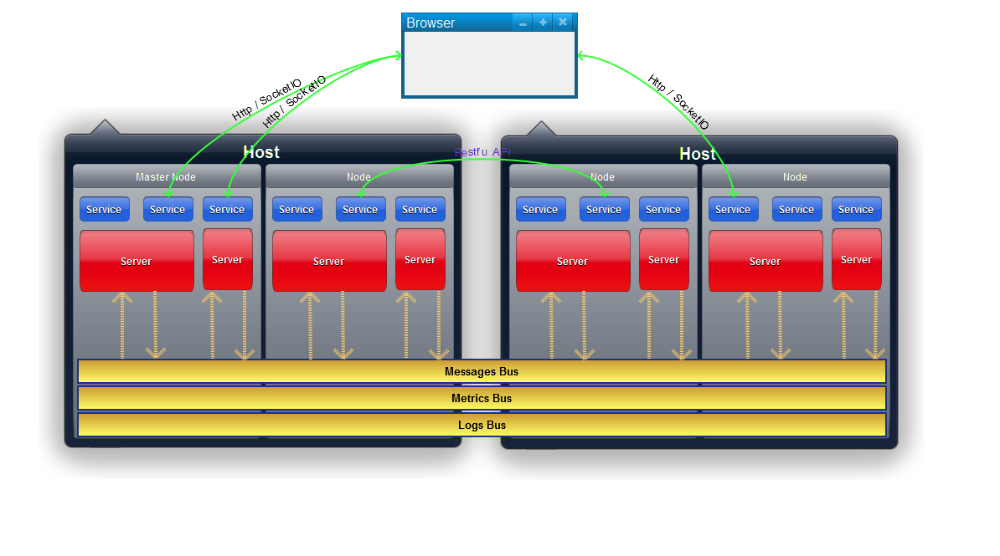
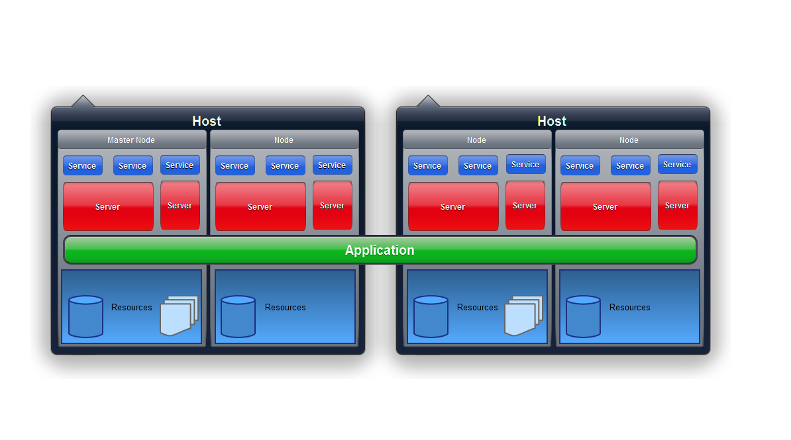

# Devapt

With DEVAPT you can easily develop powerfull application.
Built-in features cover many important subjects as: authentication, restfull, http server, distributed services, logs, metrics...
Main characteristics of DEVAPT architecture is dynamic behaviors, reactive programming, object oriented ES6 javascript, gulp build chain
All of this on NodeJS.

A usefull application is DEVTOOLS which actualy display settings, logs, buses messages, metrics and topology.
[DEVTOOLS project](https://github.com/lucbories/devapt-devtools/)

In a near futur, DEVTOOLS will act as a configurable application builder for DEVAPT applications.

devapt and devapt-* github repositories have the same structure: a master branch with the last tagged tree, a develop branch with latest comited updates and tags.

Versionning use standard method: M.m.p with M is a major change, m a minor change, p a patch.

Current version: 0.9.5 (do not use in production environment)

NPM module isn't available yet, please download devapt source insteed and make a NPM link (npm -l).

Module would be available before version 1.0.0 final.

## WHAT IS IT?

The Developpers Application Toolkit is a usefull package for developers:
create quickly and securely a complex distributed set of applications or a simple alone application into one or more nodejs.

This project is based on Javascript (ECMAscript 6 transpiled in ES5) and nodejs.
Devapt contains a server runtime and a set of client features.
Devapt help you to write less code and to use easily more features.

The principle is simple: you write some configuration files for distributed nodes, models, views and menus and the you start the application.
The framework will automatically generates the server and manages common features (logges, traces, metrics, restful, security...).
Simply launch index.html and your application is up a rich user interface and many features.

See [FEATURES](docs/FEATURES.md)

## USAGE

See [GETTING_STARTED](docs/GETTING_STARTED.md)

Documentation: [API](https://lucbories.github.io/api/index.html)

Devapt library offers a "runtime" instance which delivers this features:
* browser or server rendering (Render instance)
* rendering base class for custom widgets or views (Component class)
* Redux store on client side
* distributed servers
* master configuration settings (distributed on each nodes)
* loggers engines and traces configuration (for instances, classes, modules)
* datas abstraction
* reactive programming (thanks BaconJS)
* documentation (wotrk in progress)

## LICENCE

Copyright Luc BORIES 2015-2016

Apache Version 2 license.

See [LICENSE](LICENSE)

## ROADMAP
0.9.0   initial release (not ready for production)
1.0.0   first stable release
1.1.0   add features and tests

See [ROADMAP](docs/ROADMAP.md)

## BUGS

See [BUGS](https://github.com/lucbories/Devapt/issues)

## Technical details

With Devapt you define 
* A topology, simple (one application, one server, one service) or complex (many services distributed for many applications on many distributed servers).
* Some resources (models, views, menubars, menus)
* Security rules

A topology contains:
* nodes: A node is a nodejs process with an unique name. You can have many nodes on the same machine.
Each node communicates with other node through messaging buses (messages, metrics, logs).

A node can have one or many servers.
* servers: A server provides one or more services and listen client connections through a couple (host, port).

A server has a unique name and can be one of types: restify, express, socket.io (coming soon)...
* services: A service offers one feature to clients. A service can be one of: static assets providers, generic middleware provider, RESTfull provider, resources provider...
* applications: An application contains some services and is provided through nodes and servers.
An application can have one service on one server on one node.
Or many services on many servers on many nodes.

An application contains:
* modules: functional features for applications (a set of preconfigured UI for example).
* plugins: technical fearures for applications (a rendering provider for example).
* security: defines authentication and authorization rules.

The rendering engines are plugins and rendering classes are stateless: state is stored in a Redux store.
See [Getting Started with Redux](https://egghead.io/series/getting-started-with-redux) for flow concepts.

## Devapt is a glue between many powerfull projects
Thanks for all projects leaders and contributers.

The given list is an extract of all used or inspired projects.

Main dependancies:

NodeJS: https://nodejs.org

Servers and datas access:
* Express: http://expressjs.com/
* Restify: http://restify.com/
* Epilogue: https://github.com/dchester/epilogue
* Sequelize: http://sequelizejs.com
* Socket.io: http://socket.io/

Security:
* Passport: http://passportjs.org
* Node ACL: https://github.com/OptimalBits/node_acl

Foundations
* BaconJS: https://baconjs.github.io/
* SimpleBus: https://github.com/ajlopez/SimpleBus
* jQuery: https://jquery.com
* Immutable: https://facebook.github.io/immutable-js/docs/#/
* Redux: http://redux.js.org/docs/introduction/Motivation.html
* Moment: http://momentjs.com/
* Vantage: https://github.com/dthree/vantage
* Bunyan: https://github.com/trentm/node-bunyan
* Winston: https://github.com/winstonjs/winston
* Circuit breaker: https://www.npmjs.com/package/circuit-breaker or https://github.com/yammer/circuit-breaker-js
* LowDb: https://github.com/typicode/lowdb

Rendering:
* Foundation by ZURB: http://foundation.zurb.com/sites.html
* Mustache: https://github.com/janl/mustache.js
* React: http://facebook.github.io/react/docs/tutorial.html

Dev and build dependancies: (coming soon.)
* Babel: https://babeljs.io
* Chai: http://chaijs.com/
* Gulp: http://gulpjs.com/
* Mocha: https://mochajs.org/
* JSDoc: http://usejsdoc.org/

Installation
------------

Please see the file called INSTALL.md.

Contacts
--------

To subscribe to news or report a bug or contribute to the project, use the project website at https://github.com/lucbories/Devapt.